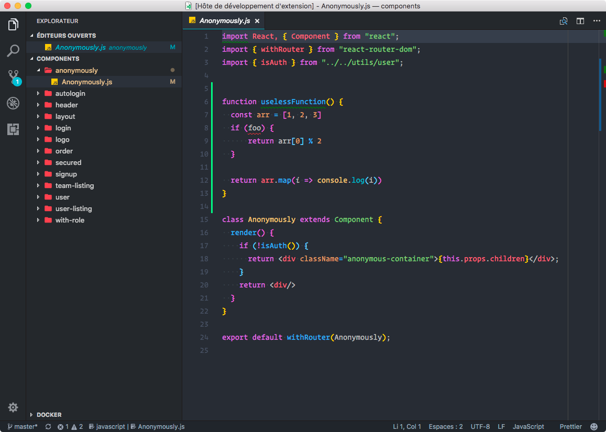
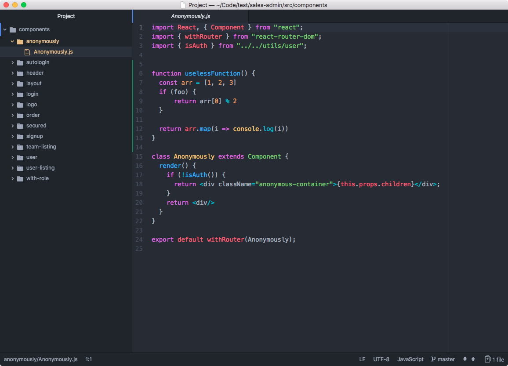

# One Dark UI

## Overview
One Dark UI is the XXX clone of the famous Atom One Dark theme.
I made it because I couldn't find a version which respect all the UI and all the syntax colors of the original Atom theme.

## To know
⚠️ Don't hesitate to give feedbacks to improve the theme or show some divergent points with the original theme (making PR / issues on the repository).

As syntax engine is different between Code and Atom, it may have some divergences however I tried to find the less compromise as possible.

## Demo
### Visual Studio Code One Dark UI

### Atom Original One Dark UI

## Contribute
Please feel free to fork, improve, make pull requests or fill issues.
I'll be glad to fix bugs you encountered or improve the theme.